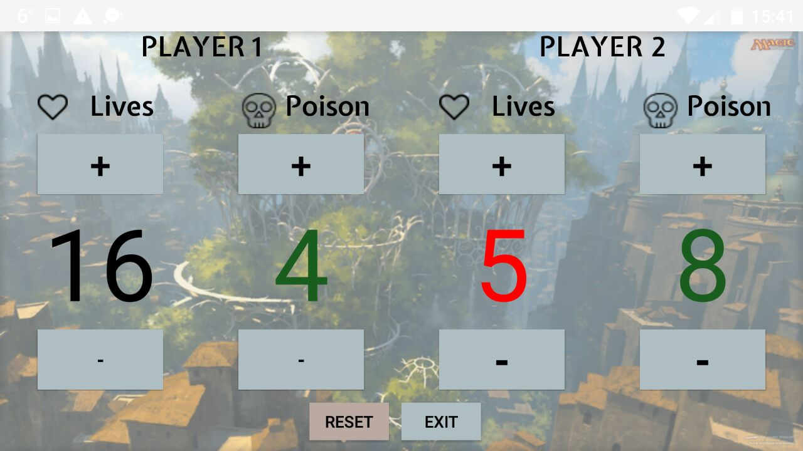

# MagicCounterApp

Here is my second project, a “Magic the Gathering” Counter.

As a Magic Player, I have been always looking for ways use an external tool to keep track of the different scores on the game, since using dices, or pen and paper is not really a comfortable solution.
Another important detail, is to be able to keep track of your enemy’s counters, because you do not want to lose a game because of some mistake, that is why I decided to design the layout in a way to allow both players to look at all the scores.
I designed a vertical view (even It's not my favorite view for this app) and a landscape view (:)!). The landscape view it is my favorite
view because when two players are playing facing each other, you want to have a clear look to the counter status of your enemy, and the best place to position my Counter App is on the side of the main battle field.

As always, you can check the code of my application here.

###### The image belongs to “Magic Gathering ®” (I downloaded it from the website: www.wallhalla.com)
